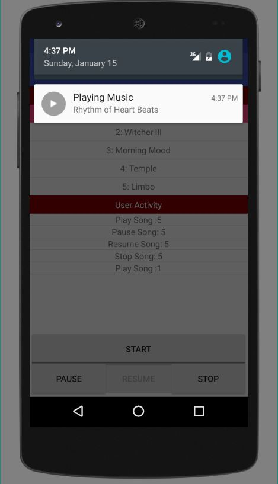

# Android Music Player
Code for an Android Studio Project to implement a Music Player application with a seperate server and client side system.

Server side code starts a service which provides an interface through AIDL(Android Interface Definition Language) to facilitate communication between server and client. On connection, the server returns an IBinder object to the client which is then used to access the methods present . Server defines the methods inside abstract subclass Stub of the AIDL interface. 

The client provides the visual interface to start/stop/pause/resume the music player. It attempts to make a connection with the server. On successful connection, client receives the IBinder object from the server to access the methods directly defined on the server side. The client also keeps track of the requests made by the user on client side system and displays it.

<h3 align="center">
	<u>Application Preview</u>
</h3>

	
	
	

